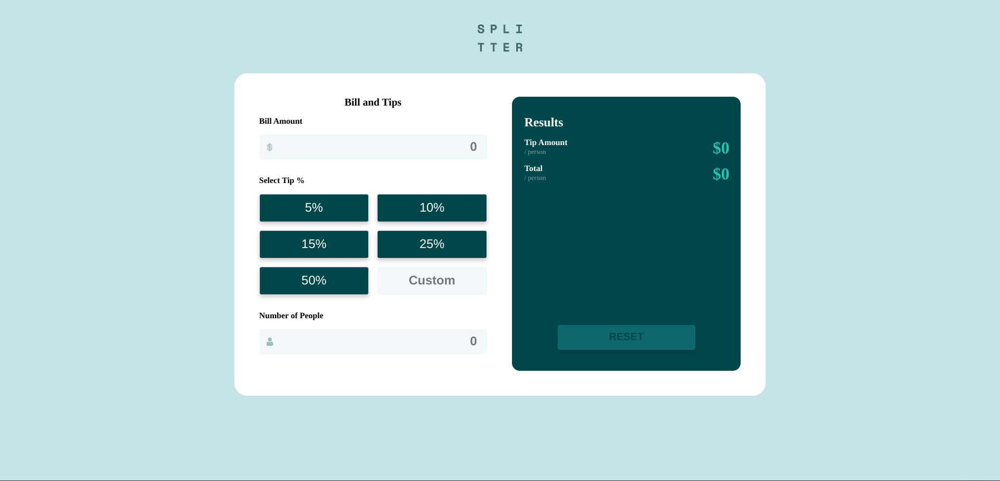

# Frontend Mentor - Tip Calculator App Solution

This is my solution to the [Tip Calculator App challenge on Frontend Mentor](https://www.frontendmentor.io/challenges/tip-calculator-app-ugJNGbJUX). The challenge helped me enhance my skills in building practical applications and improve my frontend development abilities.

## Table of contents

- [Overview](#overview)
  - [The Challenge](#the-challenge)
  - [Screenshot](#screenshot)
  - [Links](#links)
- [My Process](#my-process)
  - [Built With](#built-with)
  - [What I Learned](#what-i-learned)
  - [Continued Development](#continued-development)
  - [Useful Resources](#useful-resources)
- [Author](#author)

## Overview

### The Challenge

Users should be able to:

- View the optimal layout for the app depending on their device's screen size
- See hover states for all interactive elements on the page
- Calculate the correct tip and total cost of the bill per person
- **Extra Test using Jest:** Ensure app works using Jest

### Screenshot

### Links

- Solution URL: [GitHub Repository](https://github.com/TedJenkler/Tip-calculator-Typescript-SCSS)
- Live Site URL: [Live Demo](https://tipcalc-typescript-scss.netlify.app/)

## My Process

### Built With

- [Vite](https://vitejs.dev/) - A frontend build tool for fast development with a modern workflow.
- [React](https://reactjs.org/) - A JavaScript library for building user interfaces.
- [SCSS](https://sass-lang.com/documentation) - For advanced styling and creating flexible, maintainable stylesheets.
- [TypeScript](https://www.typescriptlang.org/docs) - For adding type safety and enhancing the development experience with static types.
- [Jest](https://jestjs.io/docs) - A testing framework for ensuring the correctness of JavaScript and TypeScript code with features like test runners, assertions, and mocking.

### What I Learned

During this project, I gained more experience in the following areas:

- **SCSS:** Enhanced understanding of SCSS features like mixins, maps, variables, and responsive design.
- **TypeScript:** Improved skills in TypeScript, including type definitions, interfaces, and generics for better type safety and code quality.
- **Custom Hooks:** Developed and utilized custom React hooks for better code organization and reusability.
- **Animations:** Gained experience in creating smooth and interactive animations to enhance the user interface and overall user experience.
- **Jest:** Acquired proficiency in using Jest for testing JavaScript and TypeScript applications

### Continued Development

- Plan to implement the tip calculation using Three.js for a fun and interactive 3D experience.

### Useful Resources

- [SCSS Documentation](https://sass-lang.com/documentation) - For comprehensive details on SCSS syntax and features.
- [TypeScript Documentation](https://www.typescriptlang.org/docs) - For learning TypeScript syntax, features, and best practices.
- [Vite Documentation](https://vitejs.dev/) - For understanding and configuring Vite as a build tool and development server.
- [Jest Documentation](https://jestjs.io/docs) - For learning how to use Jest for testing JavaScript and TypeScript applications, including setup, configuration, and best practices.

## Author

- Frontend Mentor - [@TedJenkler](https://www.frontendmentor.io/profile/TedJenkler)
- LinkedIn - [Teodor Jenkler](https://www.linkedin.com/in/tedjenklerwebdeveloper/)
- X - [@TJenkler](https://x.com/TJenkler)
- Discord - [TedJenkler](https://discord.com/users/TedJenkler)
- YouTube - [WebDevwithTed](https://www.youtube.com/@WebDevwithTed)